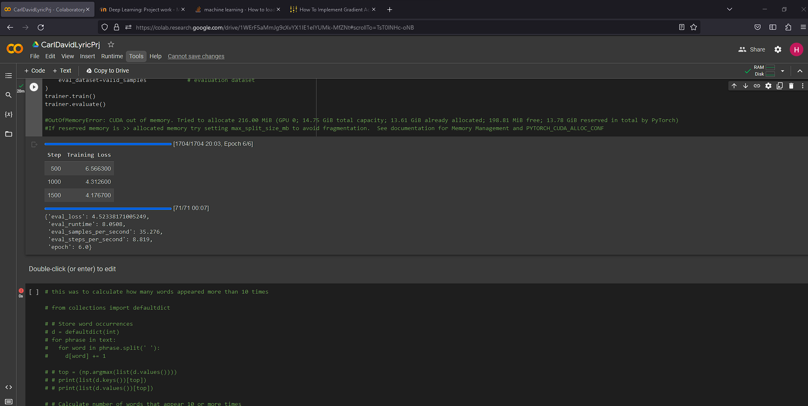

# Lyric_DLProject
##Authors: David Qian and Carl Widmann
The lyric project is a natural language processing problem where a model takes in lyrics from a certain artist and generates lyrics based on processed data about the artists past songs. Natural language processing is a deep learning model that can take in text, analyze the input, and generate new possible text.

## Abstract

We begin by importing Chloe Liu lyrics. Then, we index each word that shows up into an dictionary with words and their corresponding integers. Then we turn each lyric into sequences and convert the sequences into trainable data. We then pad the data in order to create data that is of the same length. We then split the data into the training, valid, and test data. We then standardize the data with the standard deviation and mean. 

### Training and Evaluation

We loaded in a pretrained tokenizer and the gpt2 base model. We tokenized the dataset using special tokens and split the training data. We used the train batch size of eight and the eval batch size as four because this is the max allowed by our memory. We also changed the gradient accumulation steps to four to make up for the small batch size. As of now, we are getting a loss of around 4, and we will look to improve this in the next milestone. 

